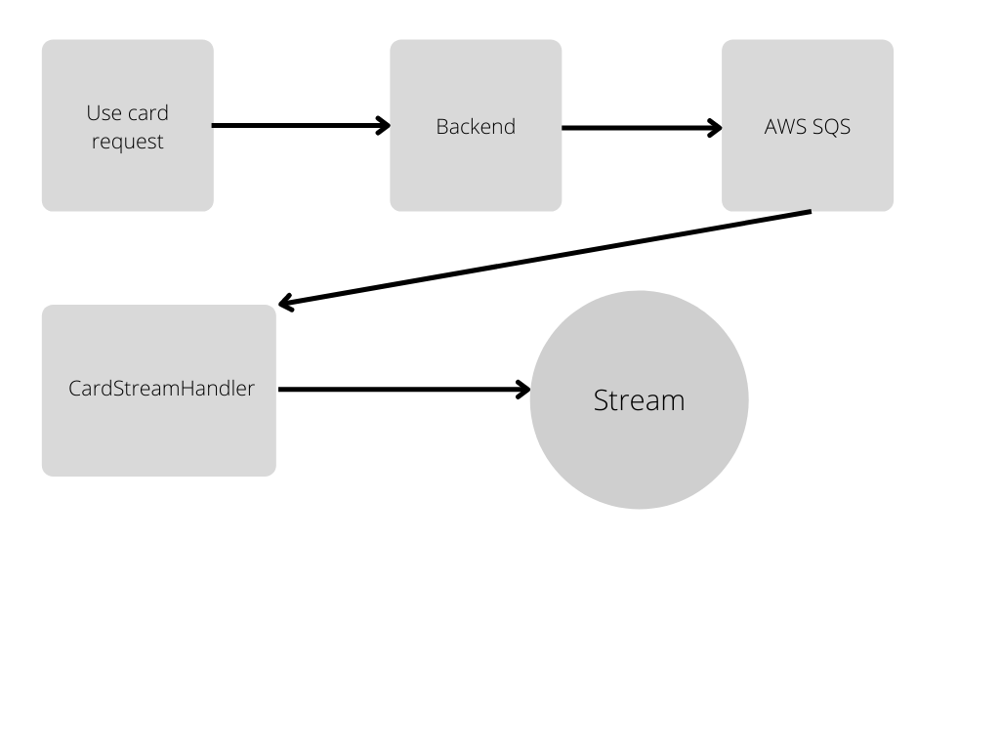

# Backend Challenge

## Data model
The database used has been MongoDb, due to its high reading capacity.
The data modeling is as follows:

**Card**

    { 
         "_id": { "$oid": "627af29daaecda1a992dc76a" },
         "name": "name test", 
          "published": false, 
           "userId": "5a50159308f5a800111de759", 
           "limited": true,
           "quantity": 123,
           "rarity":  3
           "obtained": 119,
           "used": 45
         "__v": 0
        }

**UserCard**

    {
      "streamerId": "5a50159308f5a800111de759"
      "userId": "5a50159308f5a800111de750",
      "carts": [
         {
          "cardId": "627af29daaecda1a992dc76a"
          "quantity": 3,
          "used": 2
         }
      ],
     }
This modeling has been chosen for the following points:

- The card model is only searched, used by the owner of the card and the most frequent writings of this are only to update the usage stats.
- Due to the limitation in MongoDb of a document size limit of 16Mg, I decided to use another collection where the streamer, user and the cards obtained from that streamer are referenced. In the case of having the Cards of the users in the Card model, the size of the document would grow very quickly, making it unfeasible to use or write it, that is why by doing it this way we divide the information by streamer and user, allowing the document to be small as the number of cards a streamer has, thus making reads and writes very fast.
## Architecture
Regarding the architecture of how to use the cards, I propose this:
Because in a stream there shouldn't be many cards and they have to go in the order in which they have been used, a queuing system like AWS SQS should be used where these cards are queued in order and then a microservice would be sending them to the stream respecting the cooldown between cards that the streamer has selected.

## Postman
In the repositories base there is the postman to test the operation of the backend.
